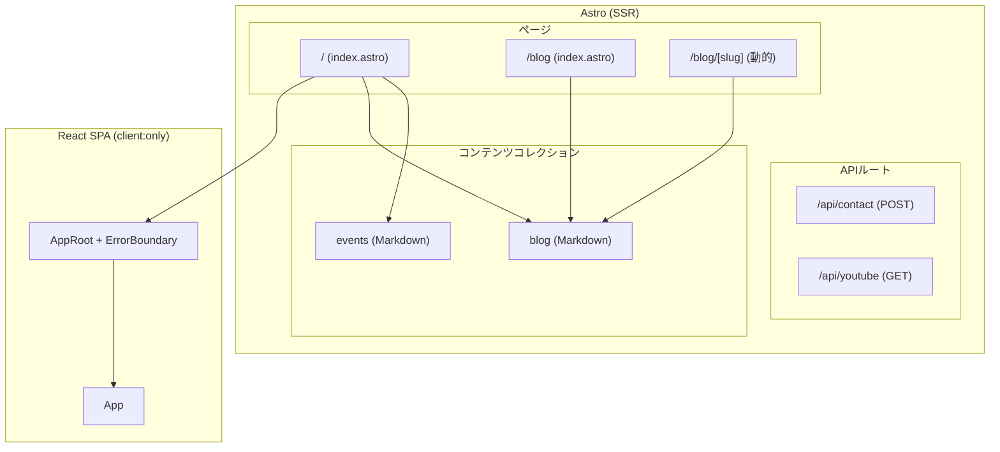
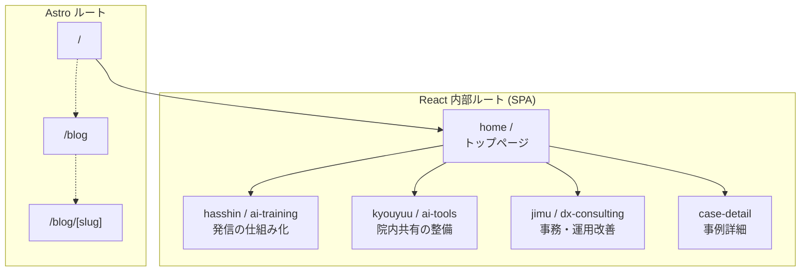
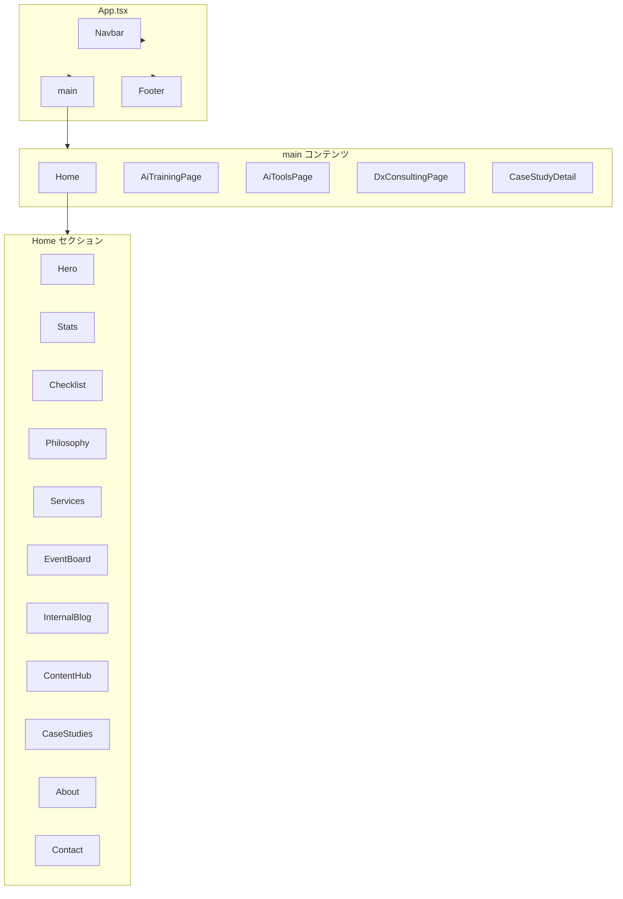
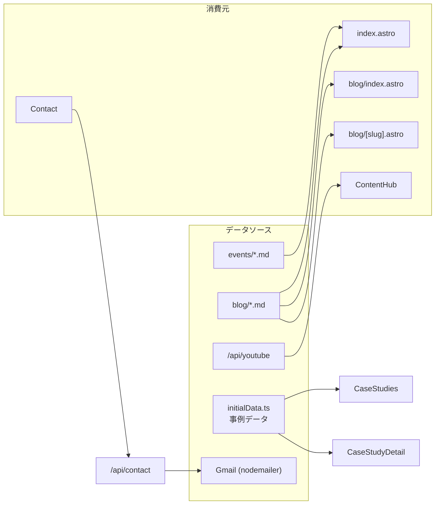
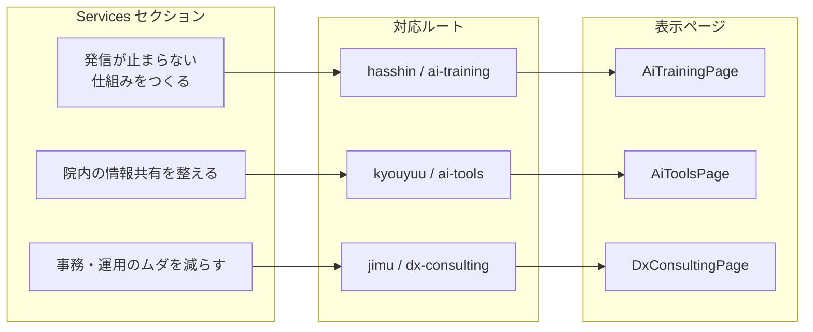
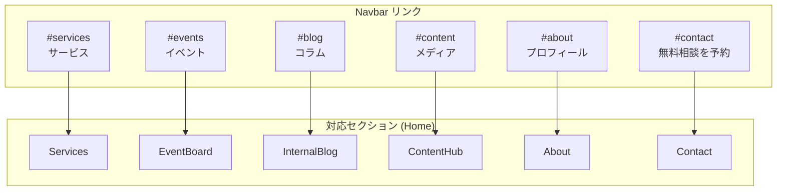
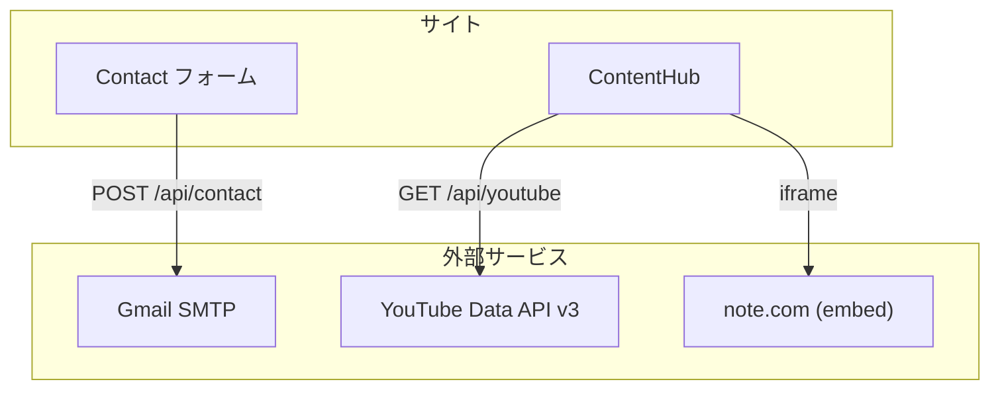
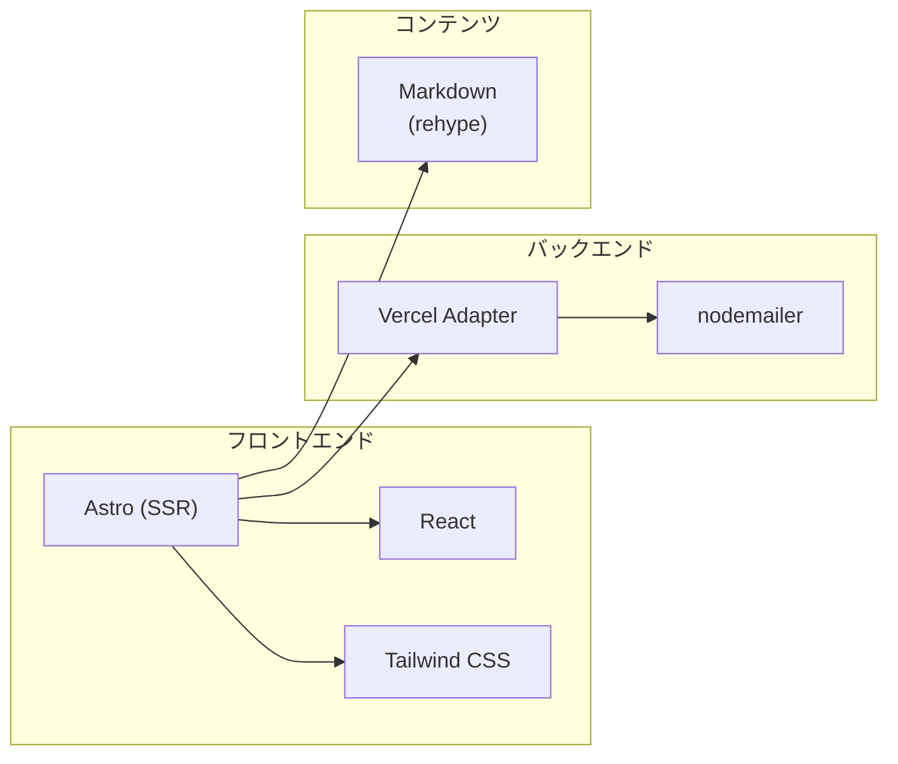

# サイト構成図（Mermaid）

## 1. 全体アーキテクチャ

```mermaid
flowchart TB
    subgraph Astro["Astro (SSR)"]
        subgraph Pages["ページ"]
            Index["/ (index.astro)"]
            BlogIndex["/blog (index.astro)"]
            BlogSlug["/blog/[slug] (動的)"]
        end
        
        subgraph API["APIルート"]
            ContactAPI["/api/contact (POST)"]
            YouTubeAPI["/api/youtube (GET)"]
        end
        
        subgraph Collections["コンテンツコレクション"]
            BlogCollection["blog (Markdown)"]
            EventsCollection["events (Markdown)"]
        end
    end
    
    subgraph React["React SPA (client:only)"]
        AppRoot["AppRoot + ErrorBoundary"]
        App["App"]
    end
    
    Index --> AppRoot
    AppRoot --> App
    Index --> BlogCollection
    Index --> EventsCollection
    BlogIndex --> BlogCollection
    BlogSlug --> BlogCollection
```

---

## 2. ページ・ルーティング構成

```mermaid
flowchart TB
    subgraph AstroRoutes["Astro ルート"]
        direction TB
        Root["/"]
        BlogList["/blog"]
        BlogPost["/blog/[slug]"]
    end
    
    subgraph ReactRoutes["React 内部ルート (SPA)"]
        direction TB
        Home["home /\nトップページ"]
        Hasshin["hasshin / ai-training\n発信の仕組み化"]
        Kyouyuu["kyouyuu / ai-tools\n院内共有の整備"]
        Jimu["jimu / dx-consulting\n事務・運用改善"]
        CaseDetail["case-detail\n事例詳細"]
    end
    
    Root --> Home
    Home --> Hasshin
    Home --> Kyouyuu
    Home --> Jimu
    Home --> CaseDetail
    
    Root -.-> BlogList
    BlogList -.-> BlogPost
```

---

## 3. コンポーネント階層

```mermaid
flowchart TB
    subgraph App["App.tsx"]
        Navbar["Navbar"]
        Main["main"]
        Footer["Footer"]
    end
    
    subgraph MainContent["main コンテンツ"]
        Home["Home"]
        AiTraining["AiTrainingPage"]
        AiTools["AiToolsPage"]
        DxConsulting["DxConsultingPage"]
        CaseStudyDetail["CaseStudyDetail"]
    end
    
    subgraph HomeComponents["Home セクション"]
        H1["Hero"]
        H2["Stats"]
        H3["Checklist"]
        H4["Philosophy"]
        H5["Services"]
        H6["EventBoard"]
        H7["InternalBlog"]
        H8["ContentHub"]
        H9["CaseStudies"]
        H10["About"]
        H11["Contact"]
    end
    
    App --> Navbar
    App --> Main
    App --> Footer
    Main --> MainContent
    Home --> HomeComponents
```

---

## 4. データフロー

```mermaid
flowchart LR
    subgraph Sources["データソース"]
        BlogMD["blog/*.md"]
        EventsMD["events/*.md"]
        InitialData["initialData.ts\n事例データ"]
        YouTubeAPI["/api/youtube"]
        Gmail["Gmail (nodemailer)"]
    end
    
    subgraph Consume["消費元"]
        Index["index.astro"]
        BlogIndex["blog/index.astro"]
        BlogSlug["blog/[slug].astro"]
        ContentHub["ContentHub"]
        Contact["Contact"]
    end
    
    BlogMD --> Index
    BlogMD --> BlogIndex
    BlogMD --> BlogSlug
    EventsMD --> Index
    InitialData --> CaseStudies["CaseStudies"]
    InitialData --> CaseStudyDetail["CaseStudyDetail"]
    YouTubeAPI --> ContentHub
    Contact --> ContactAPI["/api/contact"]
    ContactAPI --> Gmail
```

---

## 5. サービスカードとルート対応

```mermaid
flowchart LR
    subgraph Services["Services セクション"]
        S1["発信が止まらない\n仕組みをつくる"]
        S2["院内の情報共有を整える"]
        S3["事務・運用のムダを減らす"]
    end
    
    subgraph Routes["対応ルート"]
        R1["hasshin / ai-training"]
        R2["kyouyuu / ai-tools"]
        R3["jimu / dx-consulting"]
    end
    
    subgraph Pages["表示ページ"]
        P1["AiTrainingPage"]
        P2["AiToolsPage"]
        P3["DxConsultingPage"]
    end
    
    S1 --> R1 --> P1
    S2 --> R2 --> P2
    S3 --> R3 --> P3
```

---

## 6. ナビゲーション構造

```mermaid
flowchart TB
    subgraph Navbar["Navbar リンク"]
        N1["#services\nサービス"]
        N2["#events\nイベント"]
        N3["#blog\nコラム"]
        N4["#content\nメディア"]
        N5["#about\nプロフィール"]
        N6["#contact\n無料相談を予約"]
    end
    
    subgraph Sections["対応セクション (Home)"]
        S1["Services"]
        S2["EventBoard"]
        S3["InternalBlog"]
        S4["ContentHub"]
        S5["About"]
        S6["Contact"]
    end
    
    N1 --> S1
    N2 --> S2
    N3 --> S3
    N4 --> S4
    N5 --> S5
    N6 --> S6
```

---

## 7. 外部連携

```mermaid
flowchart TB
    subgraph Site["サイト"]
        ContactForm["Contact フォーム"]
        ContentHub["ContentHub"]
    end
    
    subgraph External["外部サービス"]
        Gmail["Gmail SMTP"]
        YouTube["YouTube Data API v3"]
        Note["note.com (embed)"]
    end
    
    ContactForm -->|POST /api/contact| Gmail
    ContentHub -->|GET /api/youtube| YouTube
    ContentHub -->|iframe| Note
```

---

## 8. 技術スタック概要

```mermaid
flowchart LR
    subgraph Frontend["フロントエンド"]
        Astro["Astro (SSR)"]
        React["React"]
        Tailwind["Tailwind CSS"]
    end
    
    subgraph Backend["バックエンド"]
        Vercel["Vercel Adapter"]
        NodeMailer["nodemailer"]
    end
    
    subgraph Content["コンテンツ"]
        MD["Markdown\n(rehype)"]
    end
    
    Astro --> React
    Astro --> Tailwind
    Astro --> Vercel
    Astro --> MD
    Vercel --> NodeMailer
```
